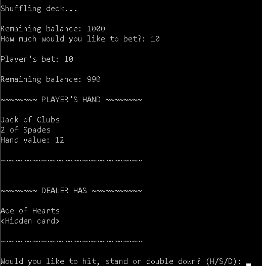
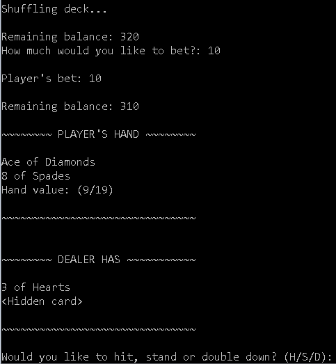

# Black Jack game

 This code allows the user to play Black Jack with a computer dealer, including
 the following features (so far):

 - Working betting system with correct pay out values.
 - Player has option to double down at start of a round.
 - Displays soft and hard hand values i.e. Ace = 1, 11.
 - User is asked if they wish to continue playing after each round and ends
 when the user is out of chips.

  
  
  

